#基本介绍

# NSLayoutConstraint属性
1. 我基本不用的属性
```objc
@property BOOL shouldBeArchived;
@property (getter=isActive) BOOL active NS_AVAILABLE(10_10, 8_0);
@property (nullable, copy) NSString *identifier NS_AVAILABLE_IOS(7_0);

```
2. 我用到的属性
```objc
@property UILayoutPriority priority;

@property (readonly, assign) id firstItem;
@property (readonly) NSLayoutAttribute firstAttribute;
@property (readonly) NSLayoutRelation relation;
@property (nullable, readonly, assign) id secondItem;
@property (readonly) NSLayoutAttribute secondAttribute;
@property (readonly) CGFloat multiplier;

@property CGFloat constant;
```
以上8个属性,只有 priority, constant不是readonly的,其他属性在创建好约束之后是不可以在修改的.
首先约束遵循以下公式:
```objc
 firstItem.firstAttribute {==,<=,>=} secondItem.secondAttribute * multiplier + constant
```
* firstItem,secondItem 
    一般都是某个UIView,secondItem可以是nil(比如指定View的长或宽时)
* firstAttribute, secondAttribute 主要有上、下、左、右、宽、高、中心点，Baseline一般是针对Label，我基本没使用。Margin表示默认边距，这个看不同的场景，这个值可能是8,20等。NSLayoutAttributeNotAnAttribute主要是针对secondItem为nil的情况
    ```objc
    typedef NS_ENUM(NSInteger, NSLayoutAttribute) {
    NSLayoutAttributeLeft = 1,
    NSLayoutAttributeRight,
    NSLayoutAttributeTop,
    NSLayoutAttributeBottom,
    NSLayoutAttributeLeading,
    NSLayoutAttributeTrailing,
    NSLayoutAttributeWidth,
    NSLayoutAttributeHeight,
    NSLayoutAttributeCenterX,
    NSLayoutAttributeCenterY,
    NSLayoutAttributeBaseline,
    NSLayoutAttributeLastBaseline = NSLayoutAttributeBaseline,
    NSLayoutAttributeFirstBaseline NS_ENUM_AVAILABLE_IOS(8_0),
    
    NSLayoutAttributeLeftMargin NS_ENUM_AVAILABLE_IOS(8_0),
    NSLayoutAttributeRightMargin NS_ENUM_AVAILABLE_IOS(8_0),
    NSLayoutAttributeTopMargin NS_ENUM_AVAILABLE_IOS(8_0),
    NSLayoutAttributeBottomMargin NS_ENUM_AVAILABLE_IOS(8_0),
    NSLayoutAttributeLeadingMargin NS_ENUM_AVAILABLE_IOS(8_0),
    NSLayoutAttributeTrailingMargin NS_ENUM_AVAILABLE_IOS(8_0),
    NSLayoutAttributeCenterXWithinMargins NS_ENUM_AVAILABLE_IOS(8_0),
    NSLayoutAttributeCenterYWithinMargins NS_ENUM_AVAILABLE_IOS(8_0),
    
    NSLayoutAttributeNotAnAttribute = 0
};
    ```
* relation 三种关系{==,<=,>=}
* multiplier 比例系数,比如firstItem的宽是secondItem宽度的两倍,这个值就为2.0
* constant 约束值,此属性可以通过代码修改,可以用于View的动画
* priority 优先级,在两个或者两个以上约束会冲突时使用,很灵活,不过我未尝试通过代码修改优先级

#在Storyboard/xib中设置约束
1. 可在Storyboard/xib中设置的所有属性
   * Identifier 目前并没有什么特别用途,只是在如果需要打印某个约束的信息时,设置了此属性可以方便定位
   * Placeholder 如果勾选了Remove at build time, 那么此约束只在Storyboard/xib中有效,编译运行是不存在此约束的

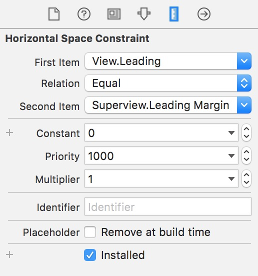

2. 第一个View
  * 点开下拉箭头,Leading,Center X,Trailing是设置对齐方式
  * Relative to margin表示对齐的时候要考虑边距,Reverse First And Second Item

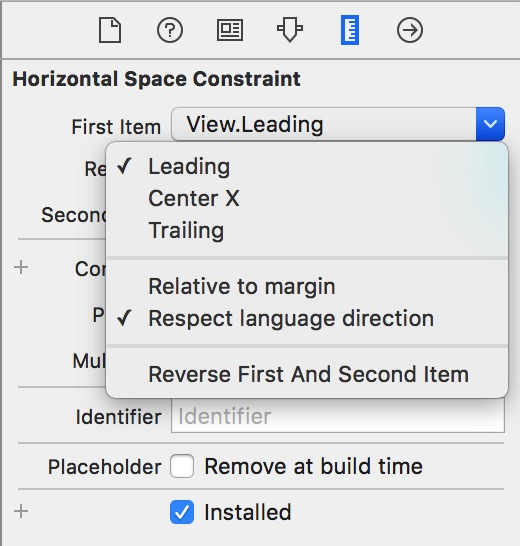

3. 第二个View
  * 勾选了Relative to margin, Leading,Center X,Trailing变为 Leading Margin,Center X WithIn Margins, Trailing Margin.
  * 在示例项目中你可以看到,secondItem的x值为20(sizeClass选择的是Any,Any模式)

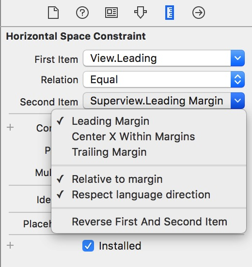

4. 关系
  *  <=,=,>=3种关系.后续的文章中会有介绍这三种关系的使用场景

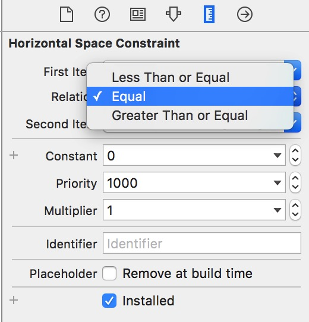

5. 约束值
  * 约束值可直接设置, 有两种方式,一般来说都是使用默认的Use Standard Value,至于Canvas模式我目前也没使用过

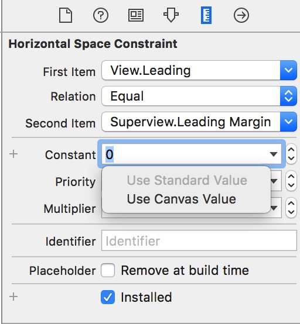

6. 约束值加号
  * 点开constant左边的加号, 可以选择SizeClass的9种模式
  * 比如添加了一种wC hAny的值为50, 将SizeClass切换成wC hAny模式后可以看到view的x值为70,边距20+50(constant的值)

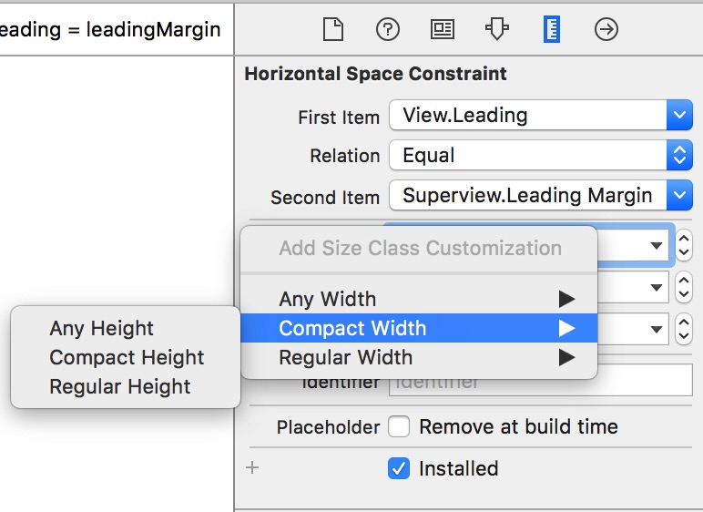
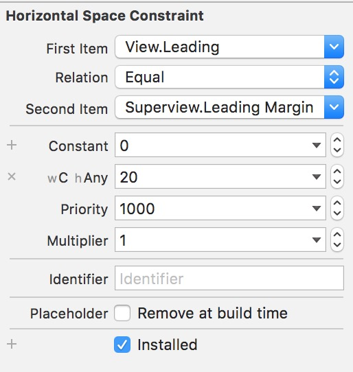

7. 优先级
  * 默认的优先级都是Required(1000),也可以设置成其他优先级,具体使用场景在后续的文章介绍

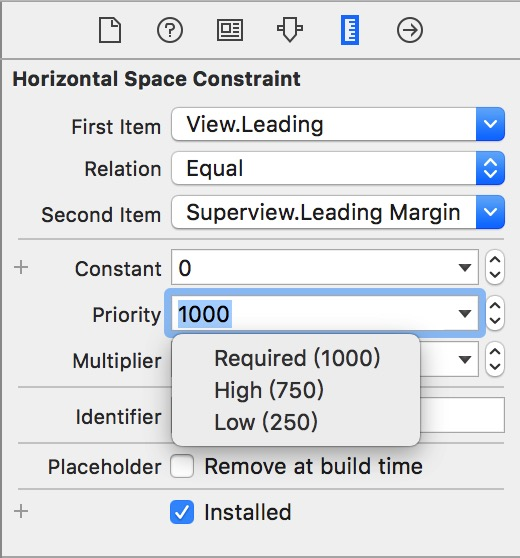

8. 比例值
  * 默认的比例值都是1.0,可以设置为比例(比如5:4),具体使用场景在后续的文章介绍

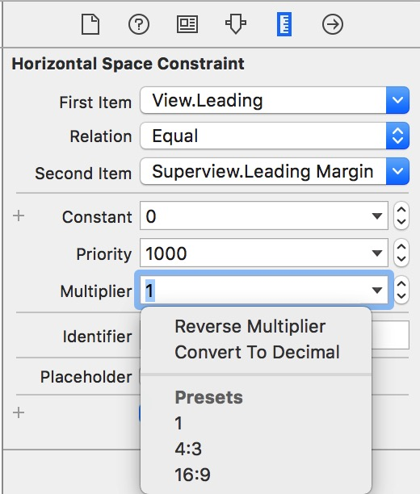

9. 安装状态加号
* 点开install左边的加号, 可以选择SizeClass的9种模式,有几种模式打勾,就表明此约束在哪些模式下可用.
* 这样在不同的SizeClass下可以使用不同的约束,而不用考虑约束冲突的情况.
* 截图中就表示在wAny hC中就不可用.切换至此模式,就会看到少一个约束的错误.

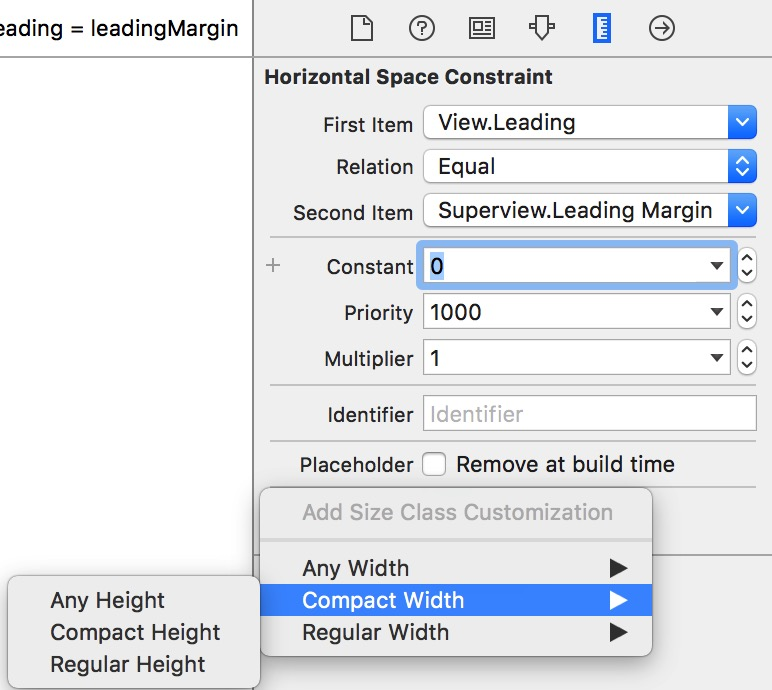
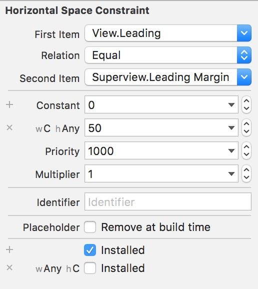
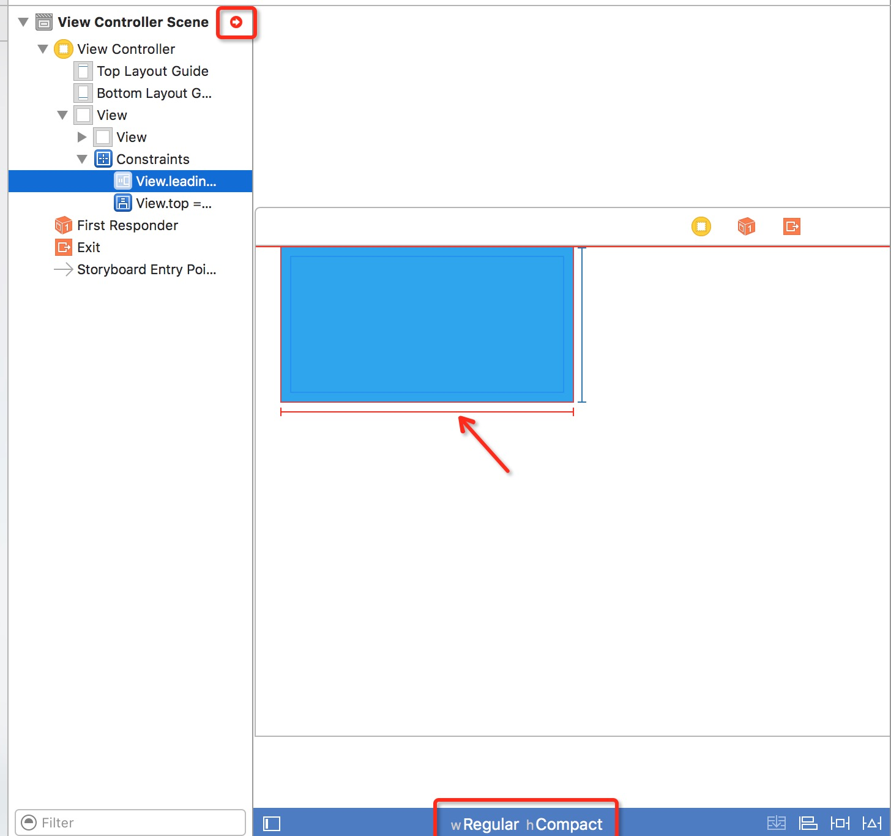

